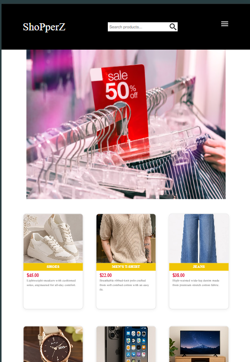
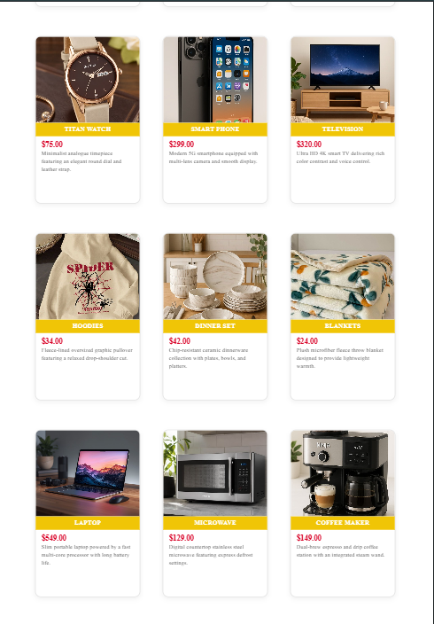
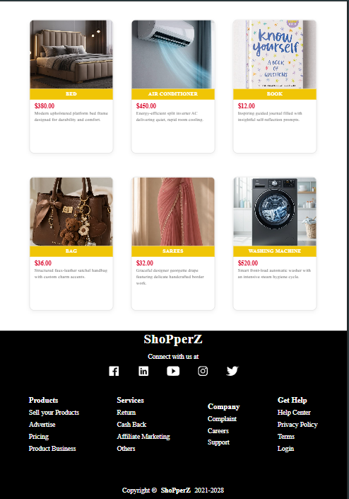

# ShoPperZ - Modern E-Commerce Storefront

## 📖 Description
ShoPperZ is an interactive and responsive e-commerce web storefront featuring a curated catalog across fashion, lifestyle, and home appliances. The application provides an engaging user experience with an automated hero carousel, a clean multi-card product grid, and client-side instant search that dynamically filters items by titles and descriptions.
---
## 📸 Project Previews

<div align="center">
  
  <br><br>
  
  <br><br>
  
</div>
---

## ✨ Features
- **Dynamic Live Search**: Real-time filtering across both product names and descriptions on every keystroke.
- **Empty State Feedback**: Displays a clear notification when no products match the user's search query.
- **Escape Key Shortcut**: Instantly clears the search query and restores the full product catalog with the `Esc` key.
- **Responsive Mobile Navigation**: Collapsible slide-out menu with smooth open/close triggers for tablet and mobile viewports.
- **CSS-Animated Hero Slider**: Continuous sliding promotional banner carousel powered by pure CSS keyframe animations.
- **Interactive Card Hover Effects**: Smooth image zoom and elevation transitions on product card interactions.

---

## 💻 Tech Stack
- **HTML5**: Semantic layout and document structure.
- **CSS3**: Responsive flexbox grid, media queries, and keyframe animations.
- **JavaScript (ES6+)**: DOM manipulation, event listeners, and dynamic client-side filtering.
- **Ionicons**: Scalable vector icons for search, navigation, and social links.

---

## 📁 Project Structure
```text
ShoPperZ/
│
├── e-commerce-website.html   # Main storefront HTML markup
├── e-commerce.css           # Styling, flexbox layout, and slider animations
├── e-commerce.js            # Search filtering logic and mobile menu drawer
├── README.md                # Project documentation
└── images/                  # Local image assets for product catalog
```

---

## 🚀 Clone Repository

```bash
git clone https://github.com/stutigupta1503/ecommerce-website.git
```

---

## 👩‍💻 Author

**Stuti Gupta** -
**GitHub**: (https://github.com/stutigupta1503) 
**LinkedIn**: (https://www.linkedin.com/in/stuti-gupta1503/)
